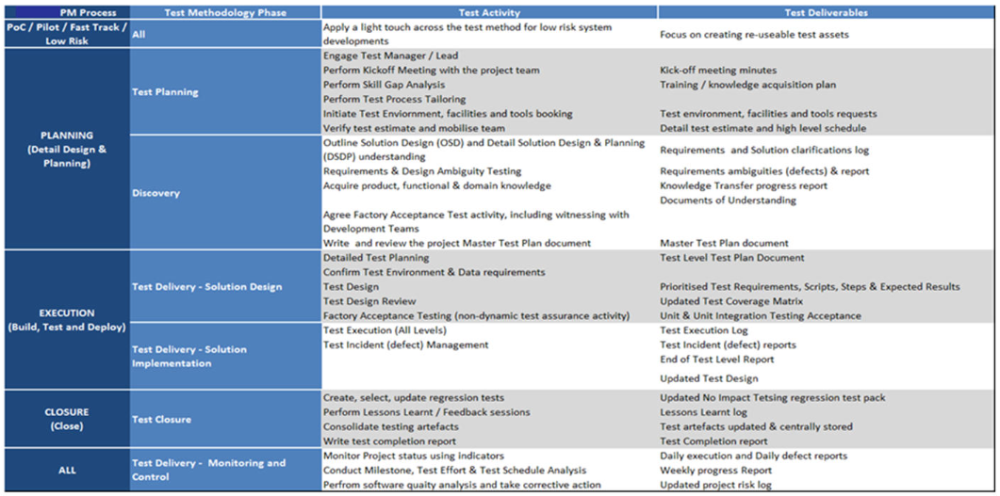

# UKHSA QAT Master Test Strategy Template

This template can be used to create a master test strategy for you project or initiative.

Version: v0.1

## Document Revision History

Project/Process Name: (Insert Project / Initiative Name)

Status: Draft (Insert Version)

Document Owner: (Insert Document Owner)

Next Review Date: Version Date + 1 year

**The latest version of this document is stored electronically. Any printed copy is an uncontrolled copy for reference or training purposes only.**

| Version | Version Date | Modified By | Revisions |
| ------ | ------------- | ----------- | --------- |
| 0.1     | 07/02/2025    |             | The text is an example of Master Test Strategy  **(Insert Version / Revision purpose)** |
|        |               |             |           |
|        |               |             |           |
|        |               |             |           |
|        |               |             |           |

| Name | Role/Organization | Date | Comment |
| ---- | ----------------- | ---- | ------- |
| | Project Manager | | |
| | Test Manager | | |
| | OAT Manager | | |
| | PT Manager | | |
| | **(Insert Names of Reviewers)** | | |

## Approvers List

| Name | Role/Organization | Date | Comment |
| - | -                 | -    | -       |
| Project Manager |                   |      |         |
| Test Manager |                   |      |         |
| QAT Manager |                   |      |         |
| <Insert Name of approver> |                   |      |         |

## Distribution List

| Organization | Role               | Name                         |
| -            | -                  | -                            |
|              | Programme Manager  | <Insert Name of Distributor> |
|              | Delivery Manager   |                              |
|              | Test Manager       |                              |
|              | QAT Manager        |                              |
|              | Business Analyst   |                              |
|              | Business Readiness |                              |

## Location

| Confluence | Insert link here |
| SharePoint | Insert link here |

 The Sections below should be reviewed and included as part of a New Project / Initiative, as required
 
# 1.0 Introduction
This Organisation Level Test Strategy is necessary to attain a common view on testing between all relevant stakeholders within the UKHSA.

Testing is an independent assessment of the state of the functionality and the achieved quality of the product.  Specifically, the Build or Development team is responsible for the state of the quality of the product.

The key benefit of the successful implementation of this test strategy is to facilitate the test function in the delivery of governance structures and standard processes needed to reduce risk and enhance the performance and value for money of testing services.

This strategy advises a consistent test approach; aligned to both any Third-Party Statement of Work (SOW), Testing Procedures) and industry best practice, which is to be adopted by UKHSA projects/initiatives.

## 1.1 Scope 
This document provides a high-level guide to the test process and practices.

The strategy is applicable to the delivery of all new solutions and systems (projects) as well as the enhancement or change of existing solutions and systems (BAU) managed under the UKHSA Contract.

## 1.2 Purpose of this document
This Test Strategy aims to:

- Attain a common view
- Define overall test objectives
- Advise a consistent test approach
- Establish the foundation for software testing
- Details the implementation of the testing process and methodology

### 1.2.1 Overview and Structure of the Document
This document also reflects Schedule 6.3 (Testing Procedures) for Test Strategy documents and details the various test cycles that could be considered for Testing and the potential Reports to be generated as articulated in this document and agreed in the schedule.

| Schedule 6.1 Statement                                                                                                                                              | This document section                        |
| -                                                                                                                                                                   | -                                             |
| Section 6.2.1 an overview of how Testing will be conducted in accordance with the Implementation Plan                                                              | 4 – Test Overview & Test Levels               |
| Section 6.2.2 a description of the approach to Testing                                                                                                             | 4 – Test Overview & Test Levels               |
| Section 6.2.3 the processes to be used to capture and record Test results and the categorisation of Test Issues                                                    | 7 Metrics and Reporting 11 Defect or Test Issue Management Process |
| Section 6.2.4 the method for mapping the expected Test results to the Test Success Criteria                                                                        | 7 Test Results tracking                        |
| Section 6.2.5 the processes to be followed by a Deliverable Test to satisfy the Test Success Criteria or produce unexpected results, including a procedure for the resolution of Test Issues | 11 Defect or Test Issue Management Process     |
| Section 6.2.6 the procedure to be followed to sign off each Test                                                                                                   | 3 Test Readiness and Assurance Process         |
| Section 6.2.7 the processes for the production and maintenance of Test Reports and reporting, including templates for the Test Reports and the Test Issue Management Log, and a sample path for the resolution of Test Issues | 7 Metrics and Reporting 11 Defect or Test Issue Management Process |
| Section 6.2.8 the names and contact details of the Authority’s and the Supplier’s Test representatives                                                              | 2.3 Key Testing Stakeholders                   |
| Section 6.2.9 a high-level identification of the resources required for Testing, including facilities, infrastructure, personnel and Authority involvement in the conduct of the Tests | 8 Organisation and resources                   |
| Section 6.2.10 any dependencies affecting the Testing, including reliance on third parties                                                                         | 1.1 Dependencies                               |
| Section 6.2.11 any assumptions made by the Supplier that may have an impact upon Testing                                                                           | 12.3 General Assumptions                       |
| Section 6.2.12 any perceived risks to Testing together with the impact of such risks and proposed methods of mitigation                                            | 12.2 Risk Management                           |
| Section 6.2.13 the technical environments required to support the Tests                                                                                            | 9 Test Tools, Environments and Data            |
| Section 6.2.14 the procedures for managing the configuration of the Test environments                                                                              | 10 Release and Configuration Management         |

### 1.2.2 Scope and Structure of the project 
The objective of this project (Insert Project / Initiative Name) And include outline of the project objectives, with details of any images / process diagrams)

## 1.3 Document Objective
The objective of this document is to ensure that the following principles are applied with consistency to the full testing lifecycle:

Reduce risk – releasing untested or under tested software, missing important faults and incurring failure costs

Risk based - test activities are prioritized according to the business impact and likelihood of a system failure occurring

Early detection – defects are to be identified and removed at the earliest possible opportunity in the project lifecycle

Highlight Dependencies – testing is not a standalone function; the test schedule requires the product to be highly testable, development to be complete and the test process not to be frequently interrupted to report problems

Progressive acceptance - opportunities are provided for the early and ongoing sign off of project deliverables

Drive out duplication – if an activity can be confirmed as appropriately completed in a test level, there is no need to repeat the same action in subsequent test levels

Measure software quality and performance of test delivery – data is captured on the efficiency and effectiveness of the test process to support ongoing test process improvement

Maintain one shared view – the production of precise reports showing the status and progress of testing for all the stakeholders, providing a common view of what is going on

Establish what is ‘good enough’ – each project provides an early and clear understanding of the minimum requirements for implementation

Collaboration – all UKHSA stakeholders and suppliers work together effectively and efficiently towards common and agreed goals

Design for testing – design and development of a product supports the ability to test and takes account of the risk-based prioritization

Use tools for specific advantage – test tools are used where appropriate, and for every tool used, the benefits will be understood and agreed in advance

# 2.0  Governance
## 2.1 Organization Level Test Strategy Sponsorship
This Test Strategy is sponsored by the UKHSA Head of Quality Assurance and Testing

## 2.2 Master Test Strategy Implementation, Assurance and Maintenance
The UKHSA Test Manager is accountable for the implementation of this Test Strategy and ensuring that it is properly and consistently implemented across the delivery of all new solutions, systems and enhancements.

All UKHSA testers, including 3rd parties and test partners are responsible for the implementation and adherence to this Test Strategy.

Any deviations are to be documented in the Project Master Test Plan document and approved by the UKHSA Test Assurance Manager or authorized representative.

The UKHSA Test Manager is accountable and responsible for maintaining this Test Strategy.

Insert specific project / initiative Governance as required.

# 3.0  Test Method and Test Deliverables
This Test Strategy drives the Project Master Test Plan and Test Level Test Plan documents. The following table shows the key deliverables with the high-level content expectations of those deliverables.

Table 3‑1 Test Method

Every project requires a Project Master Test Plan document. If the project delivery is phased; there may be a Master Test Plan document per phase or release. This document is produced during the early stages of the project lifecycle while the system requirements and high-level design are being finalized. It facilitates the forward planning of test environments, facilities, resources and also details the test schedule including the resource profile and test dependencies.

Test Level Test Plans are required for each test level within every project or phase of project; they are detailed documents that describe the testing scope, dependencies and schedule. They contain the test specification. 

# 4.0  Test Overview & Test Levels
## 4.1 Test Approach
The test approach to be taken for delivery of all new solutions and systems as well as the enhancement or change of existing solutions and systems is to:

- focus on the risks – risk-based test approach
- early and continued test engagement
- deliver transparent test deliverables
- timely and informed reporting
- focus on key test principles
- embed testing best practice
- Requirements Coverage

A Test Coverage Matrix will be used to trace requirements and solution design elements to tests.

## 4.2 Traceability is important because:
- It facilitates risk-based testing by using the risk and priority levels assigned to each requirement to drive the test approach
- It facilitates easy identification of tests to be executed when a requirement changes
- It facilitates easy identification of functional areas when tests fail unexpectedly
- It demonstrates that all requirements have been tested

Where possible it will be recommended that the test coverage matrix is captured in a Test Management Tool (e.g., JIRA).

- Risk Based Test Approach

## 4.3 Project Risk
Project risk is the possibility that an event will endanger the project; these are risks associated with events that could delay the test plan. For example: late delivery of dependencies, test environment issues, defect fix quality or turn-around time, environment system admin support.

The Project Test Team will carry out a project risk analysis, identifying risks and assigning likelihood and impact. 

The risks are to be prioritized and decisions made on the various mitigation actions or workarounds.

Project risks will be added to a project Risk Register; the risks will be re-visited through-out the project

**Product Risk**

Product risk is the possibility that the system or software might fail to satisfy a stakeholder expectation; these are risks associated with the quality of the product, for example: missing functionality, unreliable software, failures that have a financial impact, unsecure system, poor performance.

The Project Test Team will reduce the residual level of product risk by using a risk-based testing approach; tests will be prioritized and emphasized during test execution.

**Risk Based Testing Approach**

It is not efficient or effective to design and execute all possible tests, there comes a point where testing generates diminishing returns. This point is influenced by the risk associated with failure; some systems would require broader and deeper test coverage than say a system where the driver is time to market.

In addition, testing is usually subjected to time pressures that come with being the last activity in the project.

Therefore, the Project Test Team must apply techniques to balance risk with quality, features, budget, and schedule, allowing decision to be made about the scope of testing, taking into consideration project risk appetite & stakeholder agreement.

A risk-based test approach will be used for all projects in the UKHSA. The level of acceptable risk is determined during each project.  

This Risk Based Testing approach assumes that not all functionality in a System can be or should be tested.  Therefore, the testing will be driven by the priority and risk level of the linked requirement(s) or design element. This will ensure testing is focused on the areas of the solution that are most likely to fail and where failure would have the greatest business impact.

Requirements are to be assessed for technical risk and business impact and assigned a priority:

- P1 – Critical
- P2 – High
- P3 – Medium
- P4 – Low

The requirement priority will drive:

**The test planning:** design and execute in order of priority and associated risk, allowing the test team to concentrate efforts where most needed.

**The test design:** include more test conditions and apply more rigor to higher risk tests; employ relevant test design techniques to select a subset of all possible tests, choosing those that have the highest probability of finding the most defects; the test coverage provided for each requirement will be proportional to the risk assigned to that requirement.

**The test review process:** apply formal reviews to the more important tests

- Ideally business / system requirements should be assessed for risk and priority
- likelihood of failure if not tested (assessed by technical team)
- business impact of requirement failing (assessed by business)
- priority e.g. MoSCoW

 **Else**

- Requirements are assessed for technical risk and business impact and assigned a priority (P1 to P4)
- the risk & priority assessment drives:
- the test planning; design and execute tests in order of requirement priorities
- the test design; design more tests, and apply more rigor to tests that are generated by higher priority requirements
- the test review process; apply formal reviews to the more important tests

**And**

- Test exit criteria is informed by the requirements risk assessment
- Group exit criteria (# of outstanding defects and # incomplete tests) by associated requirement priority

## 4.4 Early Engagement and Static Testing
The test process will focus on finding defects as soon as possible after they are introduced. This is to minimize the cost associated with resolution in later test levels.

Many defects found during test execution and in production are often found to have a root cause in requirements; in that the requirements are ambiguous, inconsistent, or incomplete. These requirements are then wrongly interpreted in the design and later the code. Requirements and Design Ambiguity Testing (RDAT) is a formal verification process that assesses the system requirements in conjunction with the design. This process facilitates the discovery of defects as early as possible in the development lifecycle when they are cheaper to fix.

Requirements and Design Ambiguity Testing is treated as a Test Level implemented during the early stages of the project lifecycle and before Detail Solution Design and Plan is finalised at the Planning stage in the Project Management Process.

Requirements and Design Ambiguity will be applied using a formal verification process that provides structure, consistency, repeatability, and measurability. Requirements and Design Ambiguity testing will assess each requirement against the following quality attributes:

- Clarity
- Completeness
- Consistency
- Testability
- Correctness

**See Appendix B**   for a detailed list of assessment criteria. 

Any ambiguities or defects will be formally captured and used to provide the Test Manager and UKHSA project stakeholders with a quantifiable assessment of the quality of the Requirements phase. The distribution of ambiguities or defects will be reported across Severity, Status and Quality Attribute.

This activity will be carried out by experienced testers, the technique capitalizes on their knowledge and experience to deliver an industrialized approach to verifying the requirements.

The diagram below shows the recommended early involvement with the Requirements and Design Ambiguity Testing being undertaken during the requirements and design stages of the project.

Consideration will also be given in the Projects Master Test Plan should reviews be worthwhile of other early work products, for example Early prototypes, screen designs, components, and sub-units of the final deliverables.

## 4.5 Project Lifecycle Integrations
At the time of writing the UKHSA Project Delivery Lifecycle and gating process is not available.

The diagram below depicts typical alignment of the test process to the project lifecycle, showing the correlation between the Project Management Process stages, and the test activities.  Test Execution activity is broken down into Test Levels.

Table 4‑1 – Project Lifecycle Integration

## 4.6 Standard Test Level Descriptions
This section describes the industry standard and best practice test levels to be addressed by a Project Master Test Plan.

It outlines the main responsibilities for each test level, the projects assets used as the basis for testing and the object types that may be subject to test.

Not all test levels may be relevant, and some may run in parallel dependent the type of project delivery. Deviation from this model must be recorded by the Project Master Test Plan together with justifications and associated risks of not implementing these industry standard test levels.

These levels of testing are applicable to traditional (v-model / waterfall), iterative (DSDM / RAD) and agile (scrum / Kanban / extreme programming) methodologies. They describe types of test activity that can be planned as contained stages or as a package of work within an iteration / sprint.

Modify table below and include project / initiative be-poke test phases as required

Table 4‑2 Standard test Level Descriptions

| Test Level | Test Level Strategy Description | Owner | Test Objectives | Technique | Product deliverables |
| - | - | - | - | - | - |
| Requirements and Design Integrity Testing | Requirements and Design Integrity Testing (RDIT) will include review of the requirements, data entities and functional design documents within the Planning stage. | Project Test Team | Ensure requirements and solution design meet user requirements, complete and testable. | Identify the completeness for the Requirements and Solution Design Documents which are approved between BA’s and Business design team, review the following: - Configuration and functional requirements - Low Level Design - High Level Solution Design - Functional Solution Design - Non Functional Requirements | Requirements / Design Integrity Testing (RDIT) requirements or Leakage report / gaps report |
| Component Testing | Component testing covers unit level integration testing performed by developers across the scope of the project. This testing may include data transformation and calculation validity and be carried out to ensure each part/component within the software system such as user interface, APIs, functions etc. are working properly. | Developer / Dev Team | Validate and verify the functionality of proposed modules, APIs, screens and programs meet the system’s needs. | Execute component tests and undertake unit testing, including: - Individual component testing - Component integration testing - Review code coverage reports | Developer Unit Completion report |
| System Functional | System testing is concerned with the functional requirements of the system as a whole. It includes end‑to‑end functional tests based on the requirements contained in the approved solution design documentation. Note: UFD, LLD, and Acceptance Security will be maintained as testable scenarios. | Project Test Team | Ensure the application is built in line to functional and non‑functional requirements defined within detailed design documentation. | Test cycles with full system functionality executed to verify: - Business workflows - End‑to‑end requirements - Logging and issues identified from the test in triage process - Verification of confirmation screens upon defect fix | Test Pack documentation Functional Test Completion report |
| System Non‑Functional | System non‑functional test verifies non‑functional requirements for the system environment: - Performance - Usability - Accessibility - Security - Data quality characteristics - Resilience - On‑concurrency - Compatibility | Project Test Team | Ensure the application is tested in the non‑functional areas as documented in the detailed design documentation. | Non‑functional system test execution based on specification and: - Performance and load testing - Accessibility compliance reports - Usability test results - Logging and issues identified from the triage process - Verification of confirmation screens upon defect fix | As per workstream maturity Refer to the corresponding functional/non‑functional test approaches |
| System Integration Testing | The focus is on the integration itself and the interactions / communication between different systems, not the functionality of the individual systems: this is done during system testing.  It typically comes after system testing or in some large-scale integrations after acceptance testing of individual systems.  It may include specific non-functional characteristics such as performance, as well as functional testing | Project Test Team | Ensure the application is built to the solution functional requirements and specifically as documented in the detailed interface design documentation | Test scripts are built around architecture, interface specifications and requirements, i.e., how are the systems required to interact  Workflow between systems can be a basis for tests  The approach to testing is driven by the availability of interface to other platforms or systems: - Big Bang approach (all components available). Integration sequence is top down. - Incremental approach (drivers and stubs). Integration sequence is risk dependent  Regression testing should be included  Logging test issues (defects) in a tool to track them to closure  Perform confirmation tests upon defect fixes | Test Plan document Test plan schedule Test coverage matrix (against requirements) Test conditions and scripts Test Execution evidence Test issues (defects) Test execution reports Defect reports End of test level report |
| Acceptance | The goal of acceptance testing is to establish confidence in the system and its readiness for deployment. Its focus is not to find defects but to validate the system’s operation against the original requirements.  Acceptance can be progressive and therefore occur at various times in the build and test phase. It can also take different forms:  Security Acceptance: penetration testing of solution and/or underlying infrastructure  **Operational Acceptance by service delivery may include:  Testing of backup/restore Load Resilience Disaster Recovery Monitoring and Alerting User Management Data Load and Migration Checks for security vulnerabilities Operational Readiness / Business Process testing of the system in conjunction with supporting business processes  User Acceptance Testing typically verifies the system’s fitness for use by business users | UKHSA Service Delivery Organisation  UKHSA Test Mgr. | To establish confidence in the operation of the system | Testing is based upon real life operational scenarios and the non-functional requirements  Logging test issues (defects) in a tool to track them to closure  Perform confirmation tests upon defect fixes | Test Plan document(s) Test plan schedule Test coverage matrix (against requirements) Test conditions and scripts Test Execution evidence Test issues (defects) Test execution reports Defect reports End of test level report(s) |

**  Operational Acceptance – The Oracle Cloud Platform is managed by Oracle, as this programme is subscribing to this platform the actual test execution allowed by customers is dependent on the subscription service. For example, Security and Penetration Testing is not allowed against Oracle Software as a Service (SaaS) Cloud, there are also varying restrictions and rules of engagement on Platform as a Service (PaaS) and Infrastructure as a Service (IaaS). Once the design documents are available describing which system releases are hosted on the different platforms, the Master and/or Level Test Plans will provide more details on which areas require tests by this programme

4.6.1 Performance Testing
Performance Testing is a ‘Test Type’ rather than a Test Level but depending upon the requirements and risk can warrant its own Test Level Plan. Performance testing is a type of testing that is performed, from one perspective, to determine how fast some aspect of an application/system performs under a particular workload. It can also serve to validate and verify other quality attributes of the system, such as scalability, reliability, and resource usage.

The performance test in scope for each UKHSA project will be determined by the requirements and/or the risk of performance failure.  For example, if the system under test has business critical response times and includes a significant increase in load which has not been seen previously in similarly architected system, then performance testing should be included in the requirements.

If there are no requirements or no indication of a performance risk in the design, the Project Master Test Plan will state this and the reasons why performance testing has been excluded from scope.

Performance Testing should ideally (if environments allow) follow a progressive acceptance process. For example, performance specific design/architecture reviews, performance related code reviews, functional and integration tests which may consider and capture the time taken e.g., between screens and to send data over interfaces, for upper and lower limit volumes of file transfers. It should follow the same ‘detect defects early’ approach as functional testing.

The more traditional Automated Performance Test phase should ideally take place as soon as the system components and business processes identified for performance testing are available and functionally stable. It is not advisable to leave Performance Testing until the end of the project as defects found in this area tend to be costly and time consuming to fix.

Common Performance Testing Sub-Genres:

- Load
- stress
- Soak

Further to this there is also the area of ETL testing which can incorprate any of the above test types.

**Load Testing**

This is the simplest form of performance testing. A load test is usually conducted to understand the behavior of the application under a specific expected load. This load can be the expected concurrent number of users on the application performing a specific number of transactions within the set duration. This test will give out the response times of all the important business critical transactions. If the database, application server, etc. are also monitored, then this simple test can itself point towards any bottlenecks in the application software.

**Stress Testing**

This testing is normally used to understand the upper limits of capacity within the application landscape. This kind of test is done to determine the application's robustness in terms of extreme load and helps application administrators to determine if the application will perform sufficiently if the current load goes well above the expected maximum.

**Soak Testing**

This test is usually done to determine if the application can sustain the continuous expected load. During soak tests, memory utilization is monitored to detect potential leaks. Also important is performance degradation. That is, to ensure that the throughput and/or response times after some long periods of sustained activity are as good as or better than at the beginning of the test.

**ETL (Extract/Transform/Load) Performance Testing**

ETL performance testing is designed to ensure that the system under test can process data through to the end state within the timeframes stipulated for the job at the defined volumetric whilst remaining stable and not erroring.

### 4.6.2 Penetration Testing
Penetration Testing is a ‘Test Type’ rather than a Test Level but depending upon the requirements and risk can warrant its own Test Level Plan.

A Penetration Test, is an authorized simulated attack on a computer system, performed to evaluate the security of the system. The test is performed to identify vulnerabilities, including the potential for unauthorized parties to gain access to the system's features and data, as well as strengths.

Penetration Testing will be required to be carried out on all externally presented Services and Infrastructure. As a minimum it will be carried on any newly introduced externally facing Services and Infrastructure and then on an annual basis

Penetration Testing needs to comply with Section 14 of Schedule 6.3.

This is a specialist area needing to be carried out by a CREST registered penetration testing Organization. Therefore, the UKHSA ownership of this area will fall into the Security Workstream.

They will undertake:

- Discovery of the previous Penetration Testing to determine dates and outputs
- Plan and organize Penetration Testing with the Authority for newly introduced or changed externally facing Services or Infrastructure
- Plan and organize Penetration Testing with the Authority for any existing externally facing Services or Infrastructure which are due or past an annual Penetration Test

4.6.3 Approach to Accessibility Testing
Compliance with UKHSA Accessible Digital Standards. As per Section 6.1 (copied below)

UKHSA and their Suppliers shall comply with (or with equivalents to):

 

 the World Wide Web Consortium (W3C) Web Accessibility Initiative (WAI) Web Content Accessibility Guidelines (WCAG) 2.2 Conformance Level AA; and

 ISO/IEC 13066-1: 2011 Information Technology – Interoperability with assistive technology (AT) – Part 1: Requirements and recommendations for interoperability.

 Technology deliveries should ensure the above standards are inherent in all development with both above standards used as a guideline to benchmark development of Technology applications.

Any specific tools and their versions to be included in testing should be documented as non-functional requirements for traceability. As well as determining the tools to be included it may also be necessary to consider the method of access/type of device/browser version in some instances. Some devices may include inherent accessibilities tools.

Accessibility should be considered from the outset in design principles. Where an agile/digital model is developed accessibility should be inherent in show and tell sessions at each stage of the delivery.

To ensure robust testing of assistive technologies it is suggested that the use of tooling is limited to early development phases and that manual and assistive Technology users with appropriate devices where possible partake in User Acceptance Tests.

4.6.4 Equality and Diversity
Taking into account the contractual schedule (40.3 copied below) requirements will need to be documented within the requirements for the relevant delivery. This will include (but is not limited to): Assistive Technology Requirements, Standards, Welsh Language, Foreign Language, Print Solutions etc.

The Master Test Plans for the relevant delivery must include this area within its scope or out of scope section.

UKHSA and their Suppliers shall:
 

- perform its obligations under this Agreement (including those in relation to the Services) in accordance with:

  - all applicable equality Law (whether in relation to race, sex, gender reassignment, age, disability, sexual orientation, religion or belief, pregnancy, maternity or otherwise), having regard to and assisting the Authority to comply with its public sector equality duties under the Equality Act 2010

  - the Authority’s equality and diversity policy as provided to the Supplier from time to time; and

  - any other requirements and instructions which the Authority reasonably imposes in connection with any equality obligations imposed on the Authority at any time under applicable equality Law; and

- take all necessary steps, and inform the Authority of the steps taken, to prevent unlawful discrimination designated as such by any court or tribunal, or the Equality and Human Rights Commission or (any successor organisation).

# 5.0   Test Readiness and Assurance Process
## 5.1 Test Deliverable Sign-Off Procedure
The table below identifies all the test documentation types that will be delivered to UKHSA Test Assurance during the testing and shows the trigger points for derived delivery dates.

**Table 5-1**
| Title                                   | Description                                                                                                                                                            | Schedule                                                                                          |
| --------------------------------------- | ---------------------------------------------------------------------------------------------------------------------------------------------------------------------- | ------------------------------------------------------------------------------------------------- |
| Test Strategy                           | Defines the testing/validation approach across all UKHSA projects                                                                                                      | Day 1                                                                                             |
| Project Master Test Plan(s)             | Test plan(s) to test the specific areas in scope across Projects                                                                                                       | Due 20 business days prior to the start of test execution for that test phase                     |
| Test Level Test Plan                    | For larger projects that have multiple test phases (e.g., System Test, SIT, UAT)                                                                                       | Due 20 business days prior to the start of test execution for that test phase                     |
| Test Scripts                            | Test Scripts written based on requirements and design used to validate solution/process/deliverable. Testing Results will be added to the Test Scripts | Due 10 business days prior to the start of test execution for that test phase                     |
| Test Readiness Review                   | Successful completion of the Test Readiness Review                                                                                                                     | Commence 1 week before execution activities for given test phase                                  |
| Test Issue Management Process           | Defined reporting and management of defects and issues raised during test/validation activities                                                                        | To be defined as part of project                                                                  |
| Test Issue Tracker, Issues Log & Summary | Status and up‑to‑date comments of the reported defects raised via the defect management process, by individual Projects                                               | Produced at the agreed frequency stated in the Test Plan (daily)                                  |
| Project Test Status Report              | Individual Project Status Reports on Testing Progress of the agreed scope                                                                                              | Produced at the agreed frequency stated in the Test Plan (daily)                                  |
| Test Tracking Metrics                   | Tracking test progress details across Projects                                                                                                                         | Daily from commencement of Test Planning                                                          |
| Test Completion Reports                 | Collated view of all testing metrics summarised showing the outcome of testing and recommendations gated reviews – by individual Projects                              | Due 5 days after the completion of testing for each test phase                                    |
| Final Operational Readiness Review      | Completed review of all testing undertaken and overall view of service Readiness demonstrating the status of all Project Testing, and any corrective actions required | Due 1 week prior to ORR                                                                           |

All identified testing documentary deliverables will be added to a Testing Deliverables Tracker a minimum of three weeks in advance of the scheduled first draft delivery date. The Testing Deliverables Tracker will be reviewed weekly by UKHSA Test Management and the Authority Test Assurance.

It is expected that UKHSA Test Assurance will consolidate and return any review comments within 5 working days. Comment responses from UKHSA will be returned within 3 days, with final approval sign off expected from UKHSA two days later.

## 5.2 Test Witnessing
 Tests may be witnessed by the Test Witnesses in accordance with Schedule 6.3.

 The Authority may, at its sole discretion, require the attendance at any Test of one or more Test Witnesses selected by the Authority, each of whom will have appropriate skills to fulfil the role of a Test Witness. This will be agreed in advance in the Project Master Test Plan.

 UKHSA and their Suppliers will give the Test Witnesses access to any documentation and Testing environments reasonably necessary and requested by the Test Witnesses to perform their role as a Test Witness in respect of the relevant Tests.

 The Test Witnesses:

- Will actively review the Test documentation
- Will attend and engage in the performance of the Tests on behalf of the Authority to enable the Authority to gain an informed view of whether a Test Issue may be closed or whether the relevant element of the Test should be re-Tested
- Will not be involved in the execution of any Test
- Will be required to verify that the Supplier conducted the Tests in accordance with the Test Success Criteria and the relevant Project Test Plan and Test Specification
- May produce and deliver their own, independent reports on Testing, which may be used by the Authority to assess whether the Tests have been Achieved
- May raise Test Issues on the Test Issue Management Log in respect of any Testing; and
- May require the Supplier to demonstrate modifications made to any defective Deliverable before a Test Issue is closed

### 5.3 Test Entry and exit criteria
A project must determine when a system, function or service will have achieved a level of quality that is “good enough” for it to pass from:

- one supplier test level to another
- supplier system / system integration testing to acceptance testing
- acceptance testing to production ‘go live’

As essentially the system / system components handed over by the supplier for UKHSA acceptance are deemed ‘production ready’ the exit criteria from supplier testing to acceptance could be the same those from acceptance to production.

To support ongoing transparency of process and system quality:

The testers on the project will make visible to all the stakeholders what is necessary and sufficient for the product or service to go live and the difference between “good enough” and the original requirements

The test manager will reflect findings back to the business, clearly showing anything that is missing and secure their agreement through progressive acceptance of system components

Good enough to go live in production can also be just sufficient to fulfil the purpose of the solution / system and not necessarily the full implementation of the requirements. The primary focus of the exit criteria from acceptance into production should not be the number of defects remaining but rather the business impact of un-met or outstanding requirements together with the confidence provided by testing. The requirements risk assessment should be used to inform the exit criteria.

As well as test exit criteria projects will want to consider additional or final exit criteria that determine whether a supplier / project have met the terms of the original work package. These criteria will determine the final transition of a system into live production. The criteria must consider which outstanding defects can remain in the live system and which require resolution under a ‘work off’ plan, based on their business impact.

## 5.4 Entry criteria
This is a set of criteria that define when a specific test level can commence. They will, by default, include the exit criteria defined for the previous test level as well as address factors such as:

- Availability, readiness, and support of appropriate environments
- Completion and UKHSA approval of the appropriate test level plan
- Test script and test data preparation complete and approved by UKHSA
- Supporting documentation has been provided
- Required testing tools are available for use and users have been appropriately trained
- All required products have been loaded in the appropriate level of the configuration management system used for the Project
- Security access is available
- Change control procedures have been established and are applied
- A formal defect tracking mechanism has been established
- Formal metrics collection and reporting mechanism has been established
- The relevant SMEs are available to support testing

## 5.5 Suspension/ Resumption Criteria
If during any test level execution, a situation arises where no further testing will add value or be possible; the Test Manager in consultation with the Project Manager may decide to suspend test execution. The criteria that justify testing suspension are:

- Hardware/ software is not available at the times indicated in the schedule
- Source code contains critical defects and test execution paths are blocked
- Assigned test support resources are not available when needed by the Test Team
- Insufficient functionality has been delivered to execute planned tests
- Resumption will occur when the problem(s) that caused the suspension have been resolved. 

## 5.6 Exit Criteria
- All planned test cases are executed
- All defects (failures) and problems have been identified, documented, and managed according to agreed criteria which should be documented in the Project Master Test Plan
- Appropriate metrics are captured, reported, and analyzed
- The outstanding defects are documented before proceeding to the next level. Any outstanding defects will be evaluated to determine their risk to production and whether the exit criteria can be still met.
- Test Completion Report has been produced (containing details of the above criteria).
- Signoffs have been obtained as appropriate

## 5.7 Acceptance Criteria
Acceptance Criteria provides a checklist of the requirements that must be proven before the ORR confirms the Service can go live. Where no requirements exist or those that do exist have been deemed ‘insufficient’, Acceptance Criteria can be used instead of Requirements to document what needs to be demonstrated to Business Acceptors/Owners for them to sign off that Application/Service. The Business Acceptors / Owners themselves must produce or at least sign off the Acceptance Criteria prior to test execution.

Acceptance Criteria will be drafted based on as the result of formal workshops held with the relevant Business Owners/Acceptors. They must not be a substitute for Requirement’s documentation and must not be used for high priority/critical projects, applications, or services.

The Acceptance Criteria must then be reviewed and signed off by the Business Owners/Acceptors within the project initiation phase and provided into the projects Test Manager.

Acceptance Criteria must cover both functional and non-functional systems requirements, and systems documentation such as User Procedures, Operations Procedures and User Guides.

The following is a suggested list of categories for the acceptance criteria. Not all categories will be relevant to every Project:

Functional
- Key business functions
- Interfaces to other systems

Performance

- On-line response time’s - in the absence of requirements, the actual performance of the existing system can be used as a baseline for the future performance
- ETLs

Security
- Audit requirements
- Access controls

Capacity
- Number of users
- Transaction \ Reporting throughput
- Volumes of data

Resilience
- System availability
- Backup/Recovery requirements
- Contingency plans

Usability 
- Intuitive
- Consistent
- Understandable error messages

Documentation
- User Procedures
- Operational Procedures
- User Guide

## 5.8 Prioritization of Acceptance Criteria

Acceptance Criteria prioritization will be conducted by the Business Owners/Acceptors/Users and Projects who have a comprehensive understanding of the business and an appreciation of the overall requirements of the system, though they are not sufficiently documented.

A priority high, medium or low will be allocated to each Acceptance Criteria:

**High** - Mission critical acceptance criteria that must be fully tested and available as soon as the transformation has been completed. The cost to UKHSA is high if these Acceptance Criteria are unavailable for any reason and an alternative work around is impossible or very difficult. These include:

- Reports/enquiries where the information is used to make critical management or business decisions
- Information distributed to external parties, which could lead to financial loss or legal action upon error

**Medium** - Required acceptance criteria, but not absolutely critical to the business and can be worked around using other mechanisms, e.g., existing systems, manual procedures. These include:

- Acceptance Criteria where errors are more likely to cause inconvenience rather than financial loss
- Reports/enquiries that are required for day-to-day purposes but are not required to make critical management or business decisions

**Low** - Nice to have’ acceptance criteria, that can easily be worked around or left out altogether. These include:

- Acceptance Criteria maintaining non-critical data such as source information or static data that rarely changes
- Reports/enquiries where no information is used to make critical management or business decisions.

# 6 Test Automation
Test Automation has the potential to reduce test execution time and reduce costs; however, there is a heavy upfront investment, and consideration must be given to the effort involved in ongoing automation script maintenance. So, test automation should only be applied to testing where there is a clear business benefit to do so.

The testing that most benefits from automation are tests that are repeated frequently over a long period of time and do not require human intervention e.g., regression and integration testing of critical business processes, reduce manual testing effort and increase test coverage of the application.

There are several steps involved in implementing a successful test automation project:

Experienced Automation Testers have been engaged to:

- Assess Suitability and Benefit for automation (completed in bid phase)

- Select a Test Automation tool (From the UKHSA approved list of automation tools based on automation purpose) 

  - Tools Evaluation (completed in bid phase)
  - List Tools/Technologies selected and Purpose 
  - Proof of Concept
  - Tool Configuration 

Produce a Test Automation Approach

- Review Solution and identify areas for Automation (e.g. define test case selection and business flows selection criteria for the automation candidates)
- Types of tests intended to automate (i.e. smoke tests, regression tests, integration tests, end-to-end tests and data driven tests)
- Define Framework (i.e. Type of framework, scripting programming language and reports/dashboards)
- Define a scheme for selecting tests for automation (i.e. Automation tests written based on functional test cases by business priority?)
- Optimal Minimum Automation Test Coverage expected (%)
- Optimal Minimum Automation Tests Pass Rate (%), and minimum defects closure rate (%)
- Define the Management and Storage of Automated Tests and Associated Data (e.g. GitHub, S3)
- Define entry and exit criteria for the automation scripting and execution phases
- Define Test Environment requirements

  - Cloud/On-premises
  - Cross browser, OS and device testing (if applicable)
  - Parallel test execution
  - Define Automation test user accounts needs
  - User authentication exemptions, any limitations for the automation (e.g. exclusion of MFA etc.)

- Produce a Test Execution Approach
   - Define CI/CD Integration approach (e.g. execution on code commits and deployment, execution frequency and manual/scheduled trigger of jobs, parallel execution, any docker containersation applicable etc.)
   - Define test data provisioning (mock or dummy data) and data management.
   - Automated test execution and test coverage reports (e.g. Allure or html execution reports, Jira test coverage reports etc.)
   - Tests logs capture, debugging and issue logging approach

- Framework Development 
- Automation Scripting (Refer UKHSA Automation Guidance confluence pages)
- Define Test Pack Maintenance approach (e.g. manage tech debt to maintain and enhance the test packs)
- Define Code Version Control, Code Reviews and Branching strategy
- Governance and Best Practices
   - Adopting Page Object Model
   - Automation folder structure, folder/file naming and coding best practices (Refer UKHSA Automation Guidance confluence pages)
   - Test Framework Enhancement and Test Case Optimization (for reduced execution time and lower maintenance)

- Automation Risks Logging and Mitigation
- Automation Tests BAU Handover approach (e.g. Documentation of automation and handover to BAU at project closure)

Each Project Master Test Plan will describe the Test Automation usage relevant to its delivery.

# 7 Metrics and Reporting
## 7.1 Testing Results Tracking
The results of the execution of each test case will be recorded as the test case is completed. This approach allows for accurate and timely progress reporting, thus providing the Test Manager with the ability to determine the status of the testing effort at any time during the day. The Test Manager will analyze this information to determine progress against weekly completion goals.

## 7.2 Metrics & Reports
The collection, analysis and reporting of metrics is key to gauging the quality of the system under test and the effectiveness of the test process.  Metrics drive improvements and benefits for both the Programme(s) and the Customer. As such all the metrics and reports described in this section will be shared with the Programme teams including the Customer.

All projects will collect and report the following measures:
- Requirement Ambiguities by Severity, Status and Quality Attribute
- Test Execution Coverage
- Test Pass Coverage
- Defect distribution by Priority, Severity and Status
- Test Issues and Risks distribution by Test Level
- Schedule and Effort Tracking

**Table 7‑1 Reports:**
| Report                               | From               | To                                  | Copy                                   | Frequency                                          |
| ------------------------------------ | ------------------ | ------------------------------------ | -------------------------------------- | -------------------------------------------------- |
| Requirements & Design Ambiguity Report | Project Test Manager | Project Manager                      | Project Team / UKHSA Test Manager      | At end of Requirements & Design Ambiguity Testing  |
| Weekly Progress Report               | Project Test Manager | Project Manager                      | Project Team / UKHSA Test Manager      | Friday of every week                               |
| Daily Test Execution Report          | Project Test Manager | Project Manager                      | Project Team / UKHSA Test Manager      | Daily during test execution                        |
| Daily Defect Report                  | Project Test Manager | Project Manager                      | Project Team / UKHSA Test Manager      | Daily during test execution                        |
| End of Test Level Report             | Project Test Manager | Project Team / UKHSA Test Manager    |                                        | At end of each UKHSA Test Level                    |

Programmes and Projects are formed on a project-by-project basis via an NSSR. The NSSR sets out the purpose of the project, scope and all deliverables [6].

 

# 8 Organization and Resources
The Master Test Strategy created for each project, programme and enhancement. This document defines the scope of what is to be delivered, processes to be followed, as well as the resource profile and deliverables.

## 8.1 Test Organization and Interfaces
The diagram below illustrates how the testing organization fits within the project teams and proposed interfaces with the Authority Test Assurance and UAT.

Figure 7:  Project Organization Chart

## 8.2 Resources, Roles and Responsibilities
This section provides an overview of the resources, roles and responsibilities that will be required to support projects, programs and enhancements.

### 8.2.1 Test Steering Group
The purpose of the Test Steering Group is to review testing status and issues with wider programme management team on a monthly or more frequent basis during peak test times to manage risks, issues, and escalations from the Test Assurance Group.

### 8.2.2 UKHSA Acceptance Authority
The UKHSA Acceptance Authority is responsible for supporting the Testing effort by performing the following activities:

- Review the Projects Test Plans, UAT / Acceptance criteria, Test Completion Reports and Test Cases
- Produce/Review Requirements and/or Acceptance Criteria
- Respond to requests for information from the Project Test Teams
- Provide training/Workshops on the application functions to enable test case development and test execution
- Provide general support during all phases of testing
- Attending weekly Project Test Progress Meetings, if required

### 8.2.3 Test Assurance Group
The purpose of the Test Assurance Group is to review status of deliverables, risks, and dependencies on a fortnightly or more frequent basis during peak test times.

 This group feeds risks, issues and escalations into Test Steering Group and confirm upcoming test events in the next period.

 Test Managers and UKHSA Test Assurance are group members

### 8.2.4 UKHSA, Project Manager
The specific responsibilities of a Project Manager as it relates to the Project’s Testing effort are as follows:

- Overall delivery lead of the delivery activities across the defined Project
- Communicates the Project approach to all resources
- Ensures that all resources comply with the defined Test Strategy
- Facilitates communication and collaboration among project and testing resources
- Oversees the evaluation and implementation of recommended changes to the Test Plan(s) based on relevant lessons learned
- Monitors quality of activities and adherence to defined programme schedules and approach documents
- Manages testing risks, issues, assumptions, and dependencies associated with the Project
- Works with other Project Managers and Resource Manager to ensure correct resources are available in the delivery teams in line with testing schedule and that those resources are adequately trained
- Manages relationships with the Project
- Ensure that all work products and deliverables are provided on time and passed to the appropriate resources
- Accept deliverables, including those delivered by testing
- Facilitate and support the Go/No Go decision
- Review all testing deliverables upon request

### 8.2.5 UKHSA Account Test Manager
The Account Test Manager is responsible for the following activities:

- Responsibility for all testing activities, reporting into the Programme Delivery Manager
- Develop an overall high-level Test Approach and Test Strategy for the UKHSA Account
- Directs and assists, where applicable, in the preparation of testing solutions and estimates of the various activities defined in the Project schedules and Test Plans
- Coordinates and collaborates with Project and Test Managers/Leads in analyzing collected requirements to ensure the Project Test Plans and identified testing solutions meet Business Owner/Acceptor needs and expectations
- Oversees Test Managers and Test Leads for Project responsible for test specification development, maintenance, and storage
- Leads compliance to agreed standard test management methods, processes, and tools across the Account; recommends testing approach and testing metrics; secures appropriate approvals
- Monitors overall performance of testing /validation activities within the Account and provides coaching where necessary
- Leads Project testing status review meetings if required
- Manages relationships with UKHSA Test Authority, Project teams and 3rd Parties
- Reports accordingly though to Programme Delivery Manager level on status

### 8.2.6 UKHSA Project Test Manager
The Test Manager is responsible for coordinating and managing the defined Testing effort for the delivery of new or changed solutions/systems. Responsibilities include:

- Day to day responsibility for Project testing activities reporting into the Account Test Manager
- Develop a Test Plan for a testing/validation to be executed as specified in line with this Test Strategy
- Assists in the preparation of estimates of the various activities defined in the Project Test Plan(s)
- Supports the design of complex testing scenarios and test cases that will demonstrate conformance to all functional and non-functional requirements, as defined in business or technical specifications
- Coordinates and collaborates with others in analyzing collected requirements to ensure the Project Test Plan and identified testing solutions meet Business Owner/Acceptor needs and expectations
- Manages test specification development, maintenance, and storage
- Reviews test case specifications
- Co-ordinates required testing activities with Environment and Infrastructure teams
- Co-ordinates testing with external systems
- Assesses impact on testing of change requests
- Reviews and Analyses test results to confirm, establish, and communicate the cause of the discrepancy
- Assigns test tasks to individuals, monitors those tasks, and reports accordingly – for instance production of weekly Project Test Status Report
- Coordinates that testing environments are specified and provided
- Acts as a liaison between the testing organizations, suppliers, and other technical groups to resolve network and hardware problems
- Participates in the implementation of new/upgraded testing facilities
- Orientates testing resources on use of the testing environment
- Develops and manages resource plan for Test Environments
- Oversees and manages all testing activities for the Testing activities
- Ensures compliance with the associated Project-level testing strategy
- Manage testing issues, including appropriate escalation

### 8.2.7 UKHSA User Acceptance Testing Lead
The User Acceptance testing Lead has overall responsibility for coordinating and validating the defined user testing effort & outputs and is responsible for the following activities:

- Day to day responsibility for business and acceptance testing activities reporting into the Project Manager
- Support the development of a Test Plan for a testing/validation to be executed as specified in this Test Strategy
- Assists in the preparation of estimates of the various activities defined in the Project Test Plan
- Advises and supports on the design of complex testing scenarios and test cases that will demonstrate conformance to all functional and non-functional requirements, as defined in business or technical specifications
- Coordinates and collaborates with others in analyzing collected requirements to ensure the Project Test Plan and identified testing solutions meet Business Owner/Acceptor needs and expectations
- Advises and supports test specification development, maintenance, and storage
- Reviews test case specifications
- Supports co-ordination of required testing activities with Environment and Infrastructure teams
- Supports co-ordination of testing with external systems
- Assess impact on testing of change requests
- Reviews and Analyses test results to confirm, establish, and communicate the cause of the discrepancy
- Inputs to and monitoring of testing/validation tasks and reports accordingly – for instance production of weekly Project Test Status Report

### 8.2.8 Testers – UKHSA and 3rd Party 
The Testers are responsible for test analysis, design, preparation, and validation activities

Specific responsibilities for the Testers include:

- Report into Test Manager(s) or UKHSA Quality Assurance Leads as applicable
- Responsible for understanding the test requirements, developing test cases & scenarios, validating tests, raising defects, and reporting test progress
- Utilizes an appropriate testing methodology to analyze testing requirements as the basis for developing testing scenarios
- Interacts with the Project team to gain an understanding of the business environment, technical context, and conformance criteria
- Defines, identifies, collects, and organizes detailed information relating to testing requirements
- Designs testing scenarios and test cases that will demonstrate conformance to all functional and non-functional requirements, as defined in business or technical specifications
- Validation of test cases, test scripts, and test data
- Analyses the results of the testing process and recommends solutions
- Checking coverage of testing/validation activities across Applications, processes, services, and outputs
- Documents storage and quality of testing/validation collateral
- Supports production of testing/validation status reporting
- Support production of evidence for Acceptance gates

### 8.2.9 UKHSA and 3rd Party Test Issue Manager
- Sets up and owns the defect management process defined in this Test Strategy
- Procures, configures, and enables the defect management tools
- Works with Test Managers and Test Leads to manage and report on defects across the Projects ensuring defects are resolved promptly
- Supports Test Managers in daily/weekly progress reporting meetings
- Responsible for the day-to-day management of defects raised and ensuring that all defects are progressed as effectively as possible through to resolution and closure
- Reviewing all new defects to ensure, as far as possible, that the defect is recorded accurately and clearly and that severity and priority for resolution are recorded
- Ensuring that evidence of defects such as screen prints are attached to the defect report
- Assigning defects to the correct team to progress
- Ensuring defects are passed back to retest and assigned to a Test team member for retest as and when appropriate
- Liaising with the Development Team regarding workarounds, priority etc.

## 8.3 Testing Support Functions and Responsibilities
Support from the following functions is critical to efficient and effective testing:

- UKHSA, 3rd Party & Authority Project Management
- UKHSA, 3rd Party & Authority Subject-Matter Experts
- Follow any exiting CMO Operational Change Management

These functions have the following responsibilities with respect to testing support and facilitation:

### 8.3.1 UKHSA, 3rd Party & Authority Subject-Matter Experts
- Provide timely delivery of all architecture-related documentation
- Review all testing deliverables upon request
- Review Test Strategies, Test Phase Plans, Test Cases and Test Completion Reports
- Produce/Review Requirements document
- Produce Use Cases
- Respond to requests for information from the Test Team
- Guarantee the quality of all work products and deliverables
- Provide training/Workshops on the application functions to enable test case development and test execution
- Provide general support during all phases of testing
- Attending weekly Project Test Progress Meetings, if required

### 8.3.2 UKHSA and 3rd Party Test Environment, Administrator, Configuration, and Change Management
The above roles are responsible for supporting the Testing effort by performing the following activities:

- Implementing and maintaining assigned testing environments
- Acts as a liaison between the testing organizations, suppliers, and other technical groups to resolve network and hardware problems
- Analyse infrastructure performance problems and recommends solutions to enhance functionality, reliability, and/or usability
- Participate in the implementation of new/upgraded testing facilities
- Recommends changes and improvements to standards and procedures for the testing environments
- Ensures testing data/media recoverability by implementing a schedule of system backups, and database archive operations
- Orients testing resources on use of the testing environment
- Employ formal configuration/change/release management processes to ensure accurate version and asset control
- Maintain all project work products and deliverables (code and documentation) under version control, including the testing work products and deliverables produced for all test towers
- Communicate all proposed system changes
- Ensure testing involvement in impact analysis of all proposed system changes

## 8.3.3 Testing Responsibility Matrix
The detailed testing roles and responsibilities (RACI matrix) for performing, approving, or supporting the test activity will be embedded in the test plan document.

# 9 Test Tools, Environments and Data
## 9.1 Test Tools
The Initiative / Project is responsible for provisioning, licensing, and supporting Test Tools.

The following test tools will be used during the Projects test activities:

| Test Area                         | Tool                                                                                                                                                                                                                               |
| ------------------------------ | ---------------------------------------------------------------------------------------------------------------------------------------------------------------------------------------------------------------------------------- |
| (Test) Requirements Management | JIRA, R4J – Requirements Management for Jira; Zephyr Scale – Test Management for Jira.                                                                                                                                             |
| This includes Requirements & Design Ambiguity Testing, Test Coverage of Requirements. |                                                                                                                                                                                                                            |
| Test Management                | JIRA, Zephyr Scale – Test Management for Jira.    Test case, Test results, create and maintain test packs and manage the day‑to‑day test activities: test design, test execution progress and evidence, defect/issue management, and provision of test metrics/reporting. |
| Test Automation                | Microfocus Unified Functional Testing (UFT) for GUI‑based automation.   ReadyAPI by SmartBear for Integration Testing (REST, SOAP, JMS, JDBC, TCP and other Web Services).                                                      |
| Performance Testing            | Microfocus LoadRunner                                                                                                                                                                                                              |
| Test Data Management           | Currently none selected as requirements unknown. Appropriate data management tools, as dictated by the technology, will be selected and detailed in the appropriate Master Test Plan once requirements and high‑level designs are in place. |

**Table 17:  Test Tooling**

Where the decision has been taken to employ a test automation tool the project will endeavor to:

- start automating early, demonstrating the benefits early
- automate high benefit tests first, with reference to the risk-based assessment
- develop reusable test modules during early stages of testing
- not limit automation to the GUI but include functions that do not use the visible user interface (e.g., web services interfaces)

## 9.2 Test Environment
Wherever possible a production replica environment, will be used during testing on UKHSA projects from System Testing onwards. The Test Manager will work collaboratively with the Technical Teams plus UKHSA and 3rd Party suppliers where appropriate to define test environment requirements. 

The environments should be based on the production environment requirements as outlined in the Solution and Technical Designs.

Initial environment requirements will be documented within the Project Master Test Plan. Further detail will then be provided within each of the test level plans.

Both the System Integration and Acceptance test level plans must pay particular attention to the cross-domain environment requirements. However, it is recognized that test environments for the legacy and existing systems which may be required are in very short supply and are of general poor quality. The Project Master Test Plan must address the time and expense required to build and integrate new legacy systems against the benefits of reducing risk.

## 9.3 Test Data
The UKHSA Project Test Teams must define the test data management process for the projects; this includes data creation, data storage, data security (including obfuscation requirements) and data restore process. The Project Manager will manage this with support from the Supplier Test Manager and the wider Project Team.

Identifying the test data is a key element of test design, the Project Master Test Plan must give consideration to, Master Data requirements, transactional data requirements, currency of data, representation, volumes, generation, masking, and manipulation.  The Test Manager will decide if Test Data Management tools are required and document this decision in the Project Master Test Plan.

Particular attention will be paid to the UKHSA security requirements in terms of the use of live or production test data.

However, it must be noted that there is an assumption brought through from the bid stage that the initial projects will be able to use copies of production data within each environment. There is currently no cost or time provision within the programme schedule to deploy and utilise Test Data Management tools.

# 10 Release and Configuration Management
All releases used within testing or deployment must be held under configuration management [3].  All releases into test or deployment must have a release note [5].  As a minimum a Release Note will contain:

- Release Number
- Release increment number
- Type of Release (baseline / patch)
- Software components (including any test harnesses)
- Reference/Static Data upgrades
- Component & System Configuration upgrades
- Data Migration procedures
- Software Dependencies
- Hardware Dependencies
- Test Issues Resolved
- New Functionality delivered – noting - Authority Requirements
- Change Requests delivered
- Previous test phase report (which will detail known Test Issues) and the relevant ATP
- Any Risks or Issues
- All known Test Issues that are not resolved or fixed
- Release Instructions

The Project will confirm contents of a release by review of the Release Note. As soon as a suitable environment is available, the Project Test Team will request deployment on to specific test environment(s).

# 11 Defect or Test Issue Management Process
UKHSA Schedule 6.3 Testing Procedures [1] defines ‘Test Issues’. For the purposes of this document the term ‘test issue’ is understood to indicate a possibility that questionable behavior is not necessarily a true defect.

11.1 Intended audience
The following are the stakeholders for the Defect Management process:

**Project Test Manager and Test Leads** - The main users of the process.

- To understand the process and to ensure the correct data is generated for the Test Issue Management Process
- To give guidance on Defect Management and facilitate on defect causal analysis
- To suggest improvements for enriching the defect management process

**Project Managers**

- To ensure the Test Issue Management process is being followed on their project and causal analysis findings are being implemented for improvements in the project

**Project Triage manager** - Nominated by the Project Manager to chair daily Test Issue triage meetings for projects during the Test Execution phase

- Tracks and updates Severities, Assigns Defects and creates defect reports

**Resolution Teams** – Provides a resolution to a defect e.g., developers, architects

## 11.2 Defect Logging Process
Defects will be logged in a defect report so they can be followed up and resolutions can be tracked. Wherever possible the     Atlassian Cloud Jira tool will be used to log, classify, manage, analyse & report defects.

The goals of a defect report are to:

- Provide fix teams with detailed information about the issue
- Support the analysis of trends in aggregate issue data
- Support overall development or test process improvements
- 
Before recording an Issue in JIRA, the tester will:

- If possible, reproduce the defect, ideally 3 times, (for batch processing this may not be feasible)
- If it is sporadic, explain this in detail
- Isolate the issue to a part of the test script
- If the test is specific e.g., BVA (boundary value analysis), look for more generalised conditions that cause the failure

When reporting a defect, the tester will:

- Choose appropriate words; neutral, factual, clear, and unambiguous
- If appropriate relate the defect to other known defects
- Where possible attach any test evidence to the report
- After recording an Issue in JIRA use a defect review process to check the description is clear, confirm severity and to filter duplicates. Ideally defects will firstly be reviewed by a Test Team Lead or Test Manager and then assigned to a Triage manager

When recording a resolution to a defect the nominated resource(s) will:

- Analyse the root cause of the Issue
- Identify and communicate an appropriate solution
- Record where in the Software Development Lifecycle the Issue was introduced and where fixed
- If the issue cannot be recreated or more information is required; comments will be added and re-assignment of the issue back to the tester

# 12 Risk Management & Assumptions
## 12.1 Risk Management
The UKHSA Risk Management Process will be used for monitoring and control of testing-related risks. Any risk identified by the Test Teams will automatically be added to the Project RAID register and be escalated higher to get sufficient management attention.

## 12.2 General Assumptions
The following assumptions and constraints have been identified during the preparation of this document.  If any of these assumptions are modified in any way, the schedule, execution, and effectiveness of this strategy may be impacted. 

Updates to these assumptions will be documented in the appropriate Project documentation.

- Test and Pre-Prod Environments will be available in correct sequence ahead of Prod
- Environment management will manage environment usage, maintain configuration and ensure release notes are provided on changes
- Infrastructure for UFT VDIs, LoadRunner load injectors and controller will be provided on request by Oracle Cloud provider
- Functional test automation is in scope as there is a clear longer-term ROI, suitable resourcing in place to deliver alongside functional testing and deployment milestones
- Testing will be conducted from UK, India and Spain UKHSA RDC’s and testers will not be required to travel to other locations
- Security testing ITHC and any applicable penetration testing is managed by the Security Team
- Test Data will be provided by Interfaces from existing Production systems and not require obfuscation
- Security will allow copies of Production Data within all Test Environments
- There will be a Reduction / minimization of any other changes to operations during cutover period (not just IT based ones, but process change, etc.…)
- There will be a strict change control process applied to the Projects testing approach and test plan(s)
- Fully documented test scripts and results to be compiled and used throughout test procedure execution
- Where existing UKHSA, UKHSA (or 3rd Party) test collateral exists, this will be handed over to UKHSA Projects for review and validation with a view to re-use where deemed applicable
- The Testing Team(s) will require support from UKHSA and UKHSA SME’s when discrepancies arise between the expected test results and the detailed design
- The Testing Team(s) will require support from the wider Project team during the test execution phase in order to ensure prompt turnaround on defects raised
- The Testing Team(s) will require support from the UKHSA and UKHSA SMEs throughout the test planning, execution and reporting activities

 

13. Project Review: Lessons Learned
At the end of the project a review of the delivery will be undertaken to understand "What Went Well" and "What Can be Improved". The purpose of the review is to identify good process \ best practice which can be reused / adopted in future UKHSA projects. The review is not planned to be "find someone to blame" for any project mistakes or poor decisions.  The review session also provides a learning opportunity and enables all members of the delivery team to improve their understanding and issues / challenges of delivering UKHSA

The review will be conducted against the following areas using the table below:

| No. | Delivery Area                     | What Went Well | What Can Be Improved | Actions / Comments / Observations |
| --- | --------------------------------- | -------------- | --------------------- | ---------------------------------- |
| 1.  | Project Planning                   |                |                       |                                    |
| 2.  | Requirements Development           |                |                       |                                    |
| 3.  | Development                        |                |                       |                                    |
| 4.  | Functional Testing                 |                |                       |                                    |
| 5.  | Non‑Functional Testing             |                |                       |                                    |
| 6.  | Risk Management                    |                |                       |                                    |
| 7.  | Automation                         |                |                       |                                    |
| 8.  | Change Control / Release Management |                |                       |                                    |
| 9.  | Project Reporting                  |                |                       |                                    |
| 10. | Live Support / ELS                 |                |                       |                                    |

14. Project Closedown
At the completion of the project there should be a close-down of all activities.  The project manager should ensure:

- Project confluence pages are up-to-date with latest content and documents
- Share-point site contains all project documentation including meeting minutes, key emails / decisions and relevant sign-offs.
- All Jira tickets and tasks are closed down or reassigned
- Lessons Learned meeting booked and actions captured
- All project team resources rolled off
- Test Closure report produced: See link for document template: Overall Test Closure Report - <Project Name/Initiative Name> <Version> - QAT - Confluence

15. Appendix A - Acronyms & Definitions
**Automated Testing:**  Dynamic testing undertaken using tools which automate the execution of a test script or technical process

**Black box test design technique:** Procedure to derive and/or select test scripts based on an analysis of the specification, either functional or non-functional, of a component or system without reference to its internal structure

**UKHSA Testing COE:** UKHSA Centre of Excellence which provide testing resource expertise into UKHSA projects

**Defect:** A flaw in a component or system that can cause the component or system to fail to perform its required function, e.g., an incorrect statement or data definition. A defect, if encountered during execution, may cause a failure of the component or system

**DSR:** Daily Status Report

**Dynamic Testing:** Testing that involves the execution of the software of a component or system

**Exploratory Testing:** A test design technique where the tester actively controls the design of the tests as they are performed; uses information gained while testing to design new and better tests

**Governance:** The exercise of authority, management and control

**Level Test Plan:** A detailed document produced per test level, contains more information than the overall strategy or Project Master Test Plan

**LTM:** Logical Technology Model

**MTP:** Master Test Plan. A project level test plan which will be produced at the detailed design and planning stage

**NSSR:** Non-Standard Service Request

**OAT:** Operational Acceptance Test 

**POAP:** Plan on a Page

**POC:** Proof of Concept

**PTM:** Physical Technology Model

**Regression Testing:** Testing of a previously tested program following modification to ensure that defects have not been introduced or uncovered in unchanged areas of the software, as a result of the changes made. 

**RDAT:** Requirements and Design Ambiguity 

**SCCL:** Supply Chain Coordination Limited

SCTTP: Supply Chain Technology and Transformation Partner

**SIT:** System Integration Testing

**Smoke Testing:** A sub-set of tests that cover the main functionality of a system, to ascertain that the most crucial functions of a system work but not bothering with the fine detail. Used to decide if the system is ready for further testing, typically carried out at the start of the test execution phase

**Static Analysis:** Analysis of software artefacts e.g., requirements or code, carried out without execution of these software development artefacts. Static analysis can be carried out by means of a supporting tool

**Test Condition:** An item or event of a component or system that could be verified by one or more test scripts, e.g., a function, transaction, feature, quality attribute, or structural element

**Test Issue/Incident:** Any event occurring during test execution (both static and dynamic) that requires investigation

**Test Schedule:** The detailed schedule (sequence) of test scripts for execution within a test level, typically this will include dependencies, estimates on timing, resource allocation etc. and comes in the form of MS Project

**Test Script:** set of input values, execution preconditions, expected results and execution post conditions, developed for a particular objective or test condition, such as to exercise a particular program path or to verify compliance with a specific requirement

**UAT:** User Acceptance Testing 

**Usability:** The capability of the software to be understood; learned; used and be attractive to the user when used under specified conditions

**Waterfall model:** A sequential design process that flows downwards like a waterfall with testing at the end

**WSR:** Weekly Status Report

# 16 Appendix B - Ambiguity Assessment Criteria

| Quality Attribute | Considerations |
| ---------------- | -------------- |
| **Clarity** | The requirements document will be logically structured and easily readable. For example, the grouping of related items together makes it easier to find and understand them later. |
|                  | Each requirement will be specific and very clearly written to be understood. |
|                  | There will be no grey areas that only one interpretation can derive; each that is vague or subjective words, any jargon will be explained. |
|                  | Be aware if you are making assumptions, even if it is common terminology. |
|                  | Requirements will be concise – the minimum content (sentences or paragraphs) that are needed to state the point. Any terms or abbreviations will be used consistently and defined in the glossary or definitions section. |
| **Comprehensiveness** | Each requirement will be uniquely identifiable. This refers to requirements that may be reused. Identify each requirement by a reference that allows them to be subsequently changed or tracked and the amendment recorded. |
|                    | Ensure that all key stakeholders are within the requirements package, e.g., users, testers, DevOps, designers, governance sign‑offs. |
|                    | Any areas that are “to be advised” or “to be determined” are unacceptable. The effect of leaving incomplete areas will be significant during the requirements phase. |
|                    | New or updated requirements must be traceable to a relevant project goal, business requirement or internal/external source to establish achievability. |
|                    | Note legal and regulatory rules from authorities (e.g., DPA, FOI) as they will be updated as each area is grouped. |
|                    | Non-functional requirements need to include e.g., Performance, Security and Operational Approaches: availability, resilience and maintainability. |
|                    | Consider the likelihood of change, especially if the area is dynamic. |
| **Testability** | Are the requirements testable as written? Viewed from perspectives of the Architect, Developer and Tester, would they have to search for additional information before they can clearly understand, judge or test it? |
|                  | Can the requirement be verified or shown to be incorrect? |
|                  | Ensure that the requirement can be correctly measured. This means no “woolly” statements e.g., “fast”, “correct”, “best”, “reasonable use”, “2 minutes” etc. |
|                  | Any ranges must clearly define start and end values. |
|                  | Are all supporting evidence required for the requirement in place? |
| **Consistency** | Each requirement will be logically granular (e.g., relating to a single piece of functionality, a single entity or process etc). Where possible, one statement will equal one requirement. |
|                  | Challenge linked requirements. If they are necessary, their links and interdependencies will be clearly explained. |
|                  | Requirements will not be duplicated in the document. They may relate or validate each other but must not be cloned to implement subsequent changes. |
| **Correctness** | Does the requirement correctly and accurately describe the functionality to be delivered? |
|                 | Make sure the requirement is not prescriptive, but what and when it will state, not how it will be done. |
|                 | Within the known limitations and capabilities of the proposed system, consider if it is possible to deliver the requirement. |
